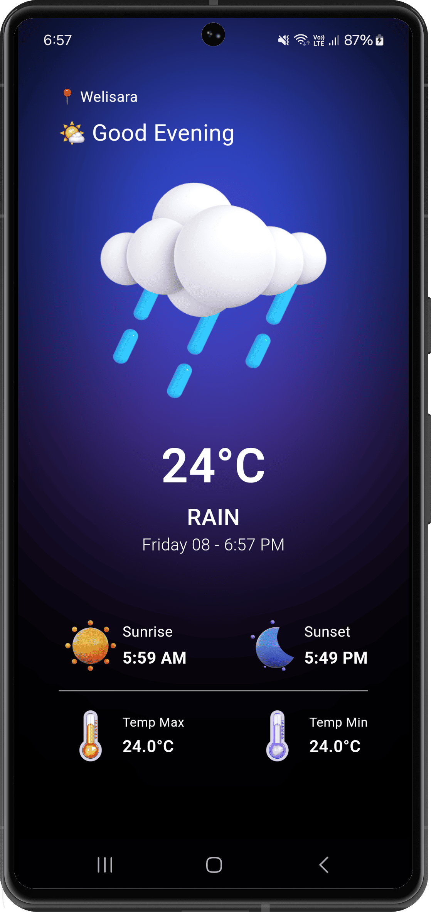

# WeatherNow

WeatherNow is a Flutter weather app that fetches live location-based weather data and displays it in a clean, user-friendly interface.

## Features

- **Location-Based Weather**: Automatically detects and displays weather for your current location.
- **Live Weather Data**: Shows temperature, humidity, wind speed, and more.
- **Clean UI**: Designed for quick readability and fast weather checking.
- **Forecast Support**: Displays weather forecasts for upcoming days.
- **Weather Icons**: Uses iconography for common weather conditions.
- **Temperature Units**: Supports Celsius and Fahrenheit.

## Getting Started

### Prerequisites

- Flutter SDK installed
- A working Android or iOS device/emulator
- Internet access for weather API calls

### Setup

1. Clone the repository:

```bash
git clone https://github.com/shresth2676/weathernowapp.git
cd weathernowapp
```

2. Install dependencies:

```bash
flutter pub get
```

3. Run the app:

```bash
flutter run
```

> If the app requires environment variables, create a `.env` file in the project root before running.

## Project Structure

- `lib/main.dart` — App entry point.
- `lib/src/app.dart` — Main app widget.
- `lib/src/core` — Core services, constants, and assets.
- `lib/src/features/weather` — Weather feature logic, data, and UI.

## Screenshots



## License

This project is licensed under the MIT License. See the [LICENSE](./LICENSE) file for details.
